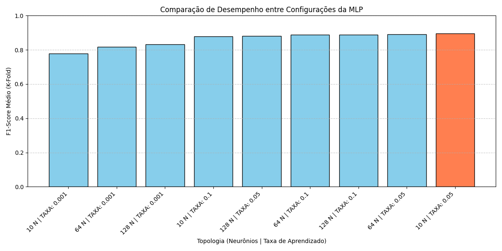
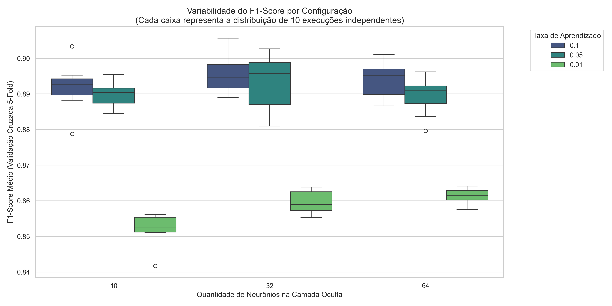
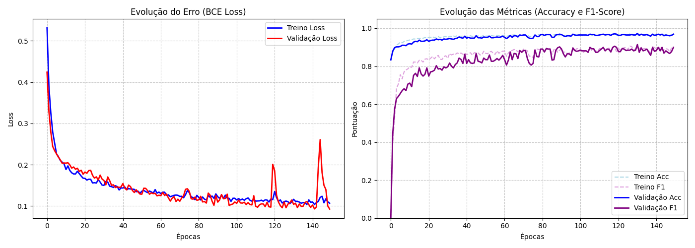

# Classificação de Fraudes Financeiras com Redes Neurais (MLP)

**Disciplina:** Inteligência Computacional    

---

## 1. Introdução e Base de Dados
Este projeto tem como objetivo desenvolver um modelo de Rede Neural Artificial (Perceptron Multicamadas - MLP) capaz de detectar transações financeiras fraudulentas. 

Para viabilizar o treinamento e seguir os requisitos do projeto, realizou-se uma amostragem estratificada controlada utilizando uma semente aleatória fixa. O dataset final contém **3.000 instâncias**, distribuídas em:
* **Classe 0 (Normais):** 2.500 instâncias
* **Classe 1 (Fraudes):** 500 instâncias

## 2. Pré-processamento e Engenharia de Atributos
Para garantir a integridade dos tensores passados à rede, um pipeline do Scikit-Learn foi implementado:
1. **Limpeza:** Colunas de identificação (`nameOrig`, `nameDest`, `isFlaggedFraud`) foram removidas para evitar ruído.
2. **Dados Numéricos:** Tratamento de valores nulos (mediana) e normalização com `StandardScaler` (média 0, variância 1).
3. **Dados Categóricos:** Imputação pela moda e transformação via `OneHotEncoder` para o atributo categórico referente ao tipo de transação.

## 3. Arquitetura da Rede e Hiperparâmetros
A topologia da rede foi construída utilizando **PyTorch**:

* **Camada Oculta:** 10 neurônios (mas foram feitos teste com 32, 64 e 128).
* **Função de Ativação:** GELU (Gaussian Error Linear Unit), escolhida por sua curvatura suave que evita o problema de "neurônios mortos".
* **Regularização:** `Dropout` de 0.3, forçando caminhos redundantes de aprendizado.
* **Otimizador:** SGD (Stochastic Gradient Descent) com **Momentum (0.9)** e Taxa de Aprendizado (LR) de 0.05.
* **Prevenção de Overfitting:** `EarlyStopping` configurado com paciência (parada de estagnação) de 15 épocas.

## 4. Experimentos e Discussão dos Resultados

### 4.1 Escolha da Topologia (Busca em Grade)
A definição de 10 neurônios com LR 0.05 foi obtida após testes iterativos com validação cruzada (K-Fold = 5). Foi verificado na prática que: após a adição do Momentum (0.9), a rede menor (10 neurônios) estabilizou os gradientes mais rápido do que arquiteturas maiores (64 e 128 neurônios), obtendo maior F1-Score médio (0.896) e prevenindo memorização.



A consistência dessa configuração foi comprovada executando-a 10 vezes com sementes diferentes, resultando em baixa dispersão de F1-Score:



### 4.2 Impacto das Estratégias de Batch
O modelo foi submetido a diferentes estratégias de cálculo de gradiente, com impacto direto no tempo de convergência e estabilidade:

| Estratégia | Lote | Tempo (s) | F1-Score | Acurácia |
| :--- | :---: | :---: | :---: | :---: |
| **Batch (Full)** | 2400 | 2.35s | 0.6951 | 91.6% |
| **Mini-batch** | 64 | 4.47s | **0.9053** | **97.0%** |
| **Stochastic (SGD)** | 1 | 171.17s| 0.0000 | 83.3% |

**Discussão:** * O **Stochastic (Lote 1)** colapsou. A grande variância ao analisar uma instância por vez em uma base desbalanceada fez o modelo chutar a classe majoritária (F1 = 0).
* O **Full Batch** parou em mínimos locais rapidamente.
* O **Mini-batch (64)** foi a estratégia campeã, equilibrando a paralelização de matrizes com a estocasticidade necessária para escapar de mínimos locais.

### 4.3 Evolução do Treinamento e Early Stopping
O gráfico abaixo ilustra o comportamento do modelo campeão ao longo das épocas. A execução do *Dropout* e do *Early Stopping* colaborou para que o treinamento fizesse a parada em um bom momento, travando a generalização antes que as curvas de Treino e Validação começassem a divergir (*overfitting*).



## 5. Avaliação Final do Modelo (Holdout)
Aplicando a configuração campeã sobre os 20% de dados guardados para teste definitivo (O "Cofre"), obtivemos a seguinte **Matriz de Confusão**:

```text
[[496   4]  <-- Verdadeiros Negativos (496) | Falsos Positivos (4)
 [ 14  86]] <-- Falsos Negativos (14)       | Verdadeiros Positivos (86)